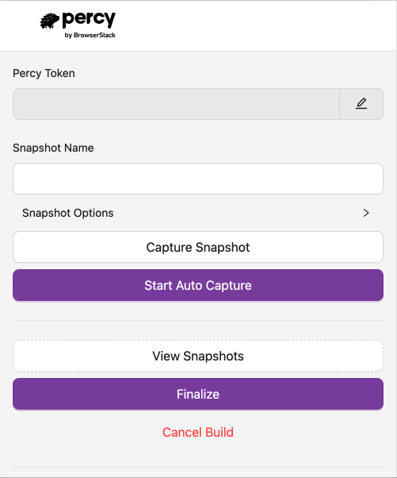
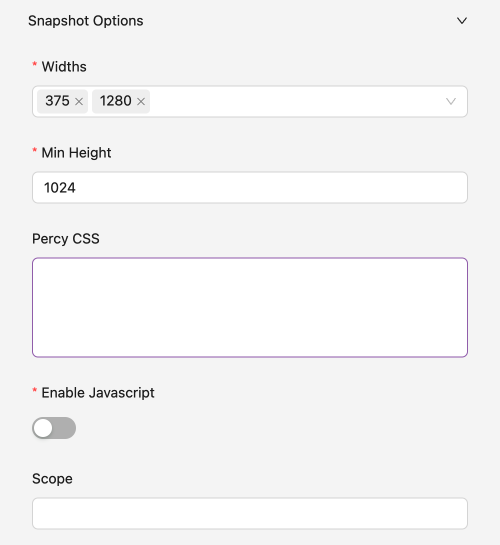
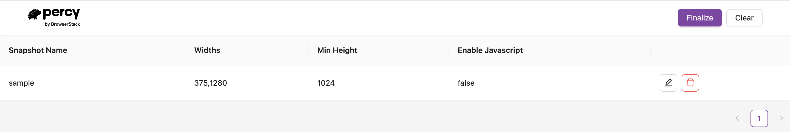
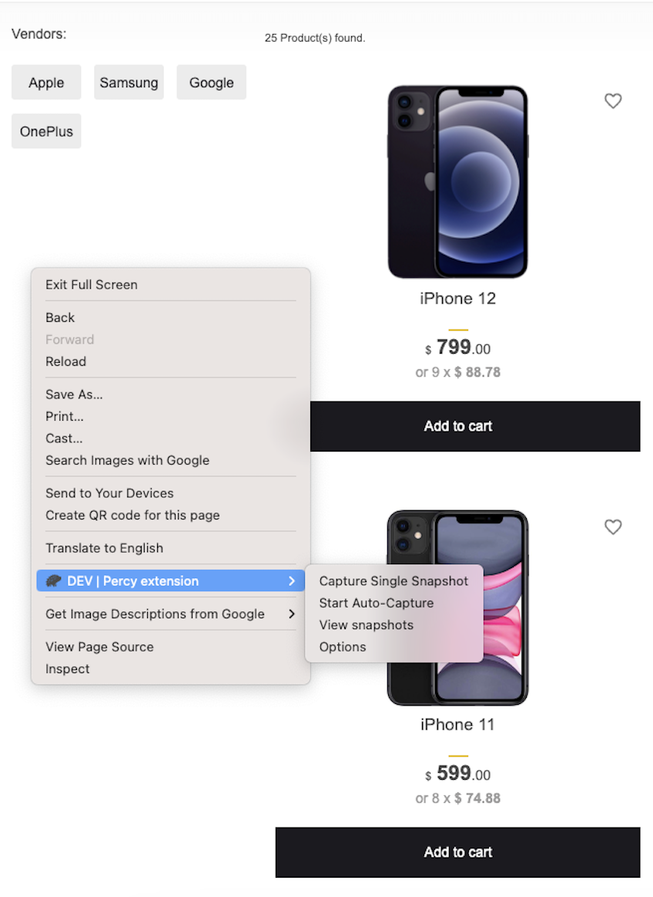
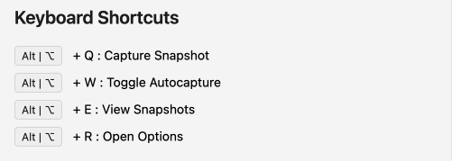

# Percy Chrome Extension
  

The Percy Chrome Extension is a versatile Chrome extension, developed within the Plasmo framework, designed to simplify visual testing and regression testing for your web applications. It offers a practical solution for users who don't have extensive automation setups and for Manual QA testers who want to streamline their visual regression testing processes.

## Introduction

Visual testing is a critical aspect of ensuring the quality and consistency of web applications. However, not all users have the resources or expertise to set up complex automation systems. The Percy Chrome Extension caters to a variety of user groups:

### Users without Automation Setup

For those who lack advanced automation setups but still wish to perform visual testing on pages protected by authentication, Percy Chrome Extension provides a straightforward solution. It allows users to access these secured pages using basic authentication or static cookies, eliminating the need to rely on developers for cookie provisioning.

### Manual QA Testers

Manual Quality Assurance (QA) testers play a pivotal role in maintaining application quality. With the Percy Chrome Extension, Manual QA testers can efficiently perform visual regression testing. Instead of configuring separate testing environments with complex .yml or .json files, they can use the extension to add URLs and seamlessly integrate visual testing into their manual workflows.

## Streamlining Manual QA Workflows

While many companies are transitioning to automation, some users prefer or require manual workflows for various reasons. The Percy Chrome Extension caters to these users, offering a user-friendly visual regression testing tool that seamlessly fits into manual QA processes. It simplifies the task of maintaining web application visual integrity, making it accessible to all.

## Extension Components

  

- **Percy Token**: A Percy token is generated when you create a Percy project. The token is a write-only API key that is unique for each project. You can find this on the Project Settings page. 

  

- **Snapshot Name**: Snapshot name is a field used to specify the name of a snapshot being uploaded to a Percy build. If you do not provide a specific value for the snapshot name in extension, the platform will automatically capture the title of the web page as the default snapshot name.

- **Snapshot Options**: Percy's snapshot options include "widths" for responsive testing, "Percy CSS" to apply custom styling, "scope" for focused element capture, and a "JS" toggle for JavaScript control, allowing tailored visual testing for web applications on various devices and scenarios.

  

- **Capture Snapshot**: Button is used to capture a snapshot of the current DOM (Document Object Model) of your active webpage. This snapshot is a visual representation of the webpage's content and layout at a specific moment in time, which can be useful for various purposes, including debugging, monitoring, or visual testing.

- **Start Autocapture**: Button will enable autocapture feature, it will start automatically capturing the the snapshot during your end to end test run, whenever a DOM change is detected. This feature reduces the need for manual intervention, ensuring that snapshots are taken as soon as there are relevant changes in the web application, making it particularly valuable for continuous testing and detecting visual regressions.

- **View Snapshots**: This button is used to review the different snapshots captured during your entire end-to-end test run. Clicking this button will take you to a separate page where you can access a list of all the snapshots that have been captured. From this page, you have the flexibility to make edits to the snapshots or delete them before finalizing the testing process. This feature provides a convenient way to inspect, manage, and ensure the quality of captured visual snapshots before they are integrated into your project.

  

- **Finalize**: This button will is used to finalize the whole test and send the snapshots to the Percy. Once you finalize you will be automatically redirected to the Percy Dashboard.

- **Cancel Build**- The button is used to cancel you whole build. All the snapshots captured will be removed.

## Different Ways to Perform Functions

Percy provides multiple ways to perform the functions mentioned above:

- **Directly from the Chrome Extension**: You can access most of these functions directly from the Percy Chrome extension's user interface. This is the most straightforward way to interact with Percy.

- **From Context Menus**: Percy integrates with the right-click context menu in your browser. This allows you to above actions directly from the context menu on a web page.

  

- **From Keyboard Shortcuts**: You can trigger the above functioanlities directly from key-board shortcuts. Please find the list below.

  

## Percy Desktop App

Percy Desktop App is an Electron application designed to enable Percy local servers on your system. Percy is an all-in-one visual testing and review platform that helps teams automate their visual QA process, catch visual bugs, and gain insights into UI changes with each commit. Our goal is to provide you and your team with confidence in the visual integrity of your user interface every time you deploy.

To install the Percy Desktop App, please follow the steps given in [this](https://github.com/BrowserStackCE/percy-desktop-app/blob/develop/README.md) documentation.

## Getting Started

To begin using the Percy Chrome Extension, follow these straightforward steps:

- **Extension Installation**: Install the Percy Chrome Extension directly from the Chrome Web Store.

- **Desktop App Installation**: Install the Percy Desktop App directly if not already Installed. Please follow the documentation to install the app.

- **Enable Extension and Desktop App**: Enable the chrome extension and desktop app.

- **Capture Snapshot**: Once you have desktop app and chrome extension enabled, go to the website/web app and start capturing snapshots. You can either capture the content individually for all the pages or use the Auto Capture functionality to automatically capture all the web pages while performing you end to end iteration.

- **Effortless Visual Testing**: Effortlessly access secured pages or workflows protected by authentication using basic auth or static cookies. No longer depend on developers for cookie setup.

- **Manual QA Testing Simplified**: For manual QA testers, add the URLs you wish to test directly within the extension. Conduct visual regression testing as an integral part of your manual workflow, without dealing with complex .yml or .json files.

## Support and Feedback

We value your feedback and welcome contributions to enhance the Percy Chrome Extension. If you have ideas for improvements or wish to contribute to the project, please visit our GitHub repository at [https://github.com/BrowserStackCE/percy-chrome-extension](https://github.com/BrowserStackCE/percy-chrome-extension).

Thank you for choosing the Percy Chrome Extension for your visual testing needs. We are dedicated to making web application testing more efficient and visually accurate.

Happy Testing!
